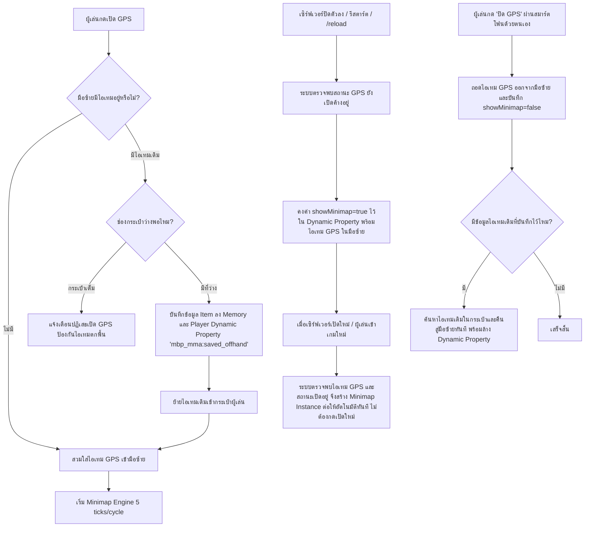

# ระบบ GPS & แผนที่นำทาง (Smartphone GPS Navigation System)

> เอกสารสรุปโครงสร้าง สถาปัตยกรรม เทคนิคการเรนเดอร์ และการควบคุมระบบ GPS ของแอดออนสมาร์ตโฟน Minecraft Bedrock 1.21+

---

## 1. บทนำและภาพรวมของระบบ (Overview)

ระบบ **GPS (Minimap & Navigation)** เป็นระบบจำลองแผนที่ดาวเทียม เรดาร์ตรวจจับสิ่งมีชีวิต และหมุดบอกพิกัด 3D แบบเรียลไทม์ โดยทำงานผสานกับไอเทมสมาร์ตโฟนในมือขวา และใช้ระบบ **Smart Offhand Swapping** ในมือซ้ายร่วมกับเทคโนโลยีการแสดงผล **Item Cooldown Category Synchronization** ไปยัง Resource Pack Attachable เพื่อเรนเดอร์แผนที่บนหน้าจอโดยไม่ต้องอาศัยการส่งแพ็กเก็ต UI ซ้ำซ้อน

---

## 2. ฟังก์ชันหลักสำหรับผู้ใช้งาน (User Features)

1. **เปิด / ปิด GPS บนหน้าจอ (Toggle GPS)**:
   - สวมใส่แผนที่ขนาดกะทัดรัด (รัศมี 48x48 บล็อก) เข้าช่องมือซ้าย (Offhand) อัตโนมัติ
   - หมุนทิศทางตามองศาการหันหน้าของผู้เล่นแบบ 360 องศา
   - แสดงทิศเหนือ (N), ทิศใต้ (S), ทิศตะวันออก (E), ทิศตะวันตก (W)
2. **โหมดแผนที่ดาวเทียมเต็มจอ (Fullscreen Satellite Mode)**:
   - ขยายมุมมองเรนเดอร์กว้างถึง 88x88 บล็อก
   - ผู้เล่นสามารถกดย่อตัว (**Shift / Sneak**) เพื่อออกจากโหมดเต็มจอและกลับสู่โหมดปกติได้ทันที
3. **ปักหมุดพิกัดใหม่ (Add Waypoint - สูงสุด 3 จุดเพื่อลดแล็ก)**:
   - จำกัดจำนวนหมุดสูงสุด **3 จุดต่อมิติ** (Overworld / Nether / End) เพื่อตัดโหลดเอนทิตีและการส่งแพ็กเก็ต Cooldown ลง 90%
   - บันทึกพิกัด X, Y, Z อัตโนมัติ ณ ตำแหน่งปัจจุบัน หรือกำหนดพิกัดเอง
   - ตั้งชื่อหมุดและเลือกสีไอคอนหมุดได้ 16 สี
   - รองรับตัวเลือกเปิด/ปิด **ป้ายโฮโลแกรม 3D ลอยในโลกจริง** พร้อมกลไก **Anti-Lag Throttling** (Teleport เฉพาะเมื่อตำแหน่งเปลี่ยน > 0.25 บล็อก และอัปเดต NameTag เมื่อระยะเปลี่ยน >= 1 เมตร)
4. **สมุดบันทึกหมุดนำทาง & ระบบแชร์หมุดให้เพื่อน (Waypoints Manager & Share)**:
   - ดูรายการหมุดทั้งหมดในมิตินั้นๆ แสดงจำนวน `X/3 จุด`
   - สลับเปิด/ปิดโฮโลแกรม 3D เฉพาะจุด
   - **ส่งหมุดให้เพื่อน (Share Pin to Friends)**:
     - ส่งหมุดเข้าเครื่อง GPS ของเพื่อนที่ออนไลน์ (เลือกส่งรายบุคคล หรือส่งให้ทุกคนในเซิร์ฟเวอร์)
     - หมุดจะปรากฏบนหน้าจอ Minimap และแสดงป้ายโฮโลแกรม 3D ในโลกจริงของเพื่อนทันที พร้อมระบุชื่อคนแชร์กำกับ เช่น `บ้าน (Steve)`
     - ระบบส่งเสียงแจ้งเตือนและ Toast Notification ไปยังเพื่อนผู้รับแบบ Real-time
   - **แชร์ตำแหน่งปัจจุบันให้เพื่อน (Quick Share Location)**:
     - ส่งพิกัดตำแหน่งที่ผู้เล่นกำลังยืนอยู่ให้เพื่อนเห็นทันทีผ่านหน้าแรกของแอป โดยไม่ต้องบันทึกล่วงหน้า
   - **ประกาศพิกัดลงแชตเซิร์ฟเวอร์**: ส่งข้อความพิกัดให้ทุกคนในเซิร์ฟเวอร์ทราบผ่าน Chat
   - ลบหมุดที่ไม่ต้องการออก
5. **เรดาร์สิ่งมีชีวิต (Mob Radar)**:
   - แสดงไอคอนรูปหน้าม็อบและผู้เล่นจริงรอบตัว 50 ตัวบนแผนที่
   - สแกนและอัปเดตตำแหน่งแบบไดนามิก รองรับม็อบทุกชนิดในเกมกว่า 90 สายพันธุ์
6. **ระบบสแกนถ้ำอัตโนมัติ (Cave Mode)**:
   - เมื่อผู้เล่นเดินเข้าสู่ใต้ดินหรือโพรงถ้ำ แผนที่จะตัดส่วนเพดานหินออก และเรนเดอร์เฉพาะโพรงทางเดินภายในถ้ำ

---

## 3. สถาปัตยกรรมความปลอดภัยของช่องมือซ้าย (Smart Offhand Safety)

จุดเด่นสำคัญของระบบคือ **"ของในมือซ้ายเดิมต้องไม่สูญหายเด็ดขาด และรองรับคำสั่ง /reload ของเซิร์ฟเวอร์แบบ 100%"** จัดการโดย `GpsOffhandManager.js`:



---

## 4. ระบบการตั้งค่าส่วนบุคคล (Per-Player Personal Settings)

ระบบ GPS ใช้การตั้งค่า **"แยกรายบุคคล"** ผู้เล่นแต่ละคนปรับแต่งค่า GPS ของตัวเองได้อิสระ ไม่กระทบคนอื่น:

| รายการตั้งค่า | ประเภท | คำอธิบาย |
| :--- | :---: | :--- |
| **1. โหมดสแกนถ้ำอัตโนมัติ** | Toggle | ตัดเพดานทึบเพื่อแสดงทางเดินในถ้ำเมื่อผู้เล่นอยู่ใต้ดิน |
| **2. เรดาร์สิ่งมีชีวิต** | Toggle | เปิด/ปิดการตรวจจับและเรนเดอร์ไอคอนม็อบ 90 ชนิด |
| **3. ป้ายโฮโลแกรม 3D** | Toggle | เปิด/ปิดการเรนเดอร์ป้ายชื่อหมุดลอยในโลกจริง |
| **4. สีกรอบแผนที่ GPS** | Dropdown | เลือกสีขอบจอ 16 เฉดสีตามความสวยงาม |
| **5. ระยะห่างจากขอบบน** | Slider | ปรับระยะเยื้องแนวตั้ง (0–15 พิกเซล) |
| **6. ระยะห่างจากขอบขวา** | Slider | ปรับระยะเยื้องแนวนอน (0–78 พิกเซล) |
| **7. คืนค่าเริ่มต้นทั้งหมด** | Toggle | รีเซ็ตการตั้งค่าทั้งหมดกลับเป็นค่าเริ่มต้น (ยกเว้นสถานะเปิด/ปิด GPS) |

- **สิทธิ์การเข้าถึง**: ผู้เล่นทุกคนเข้าถึงเมนู `ตั้งค่าระบบ GPS` ได้โดยไม่ต้องมี Tag `admin`
- **การจัดเก็บข้อมูล**:
  - การตั้งค่าทั้งหมด: บันทึกใน `player.setDynamicProperty('mbp_mma:player_gps_settings', ...)` (แยกรายบุคคล)
  - ค่าเริ่มต้น: กำหนดใน `PlayerSettingsManager.DEFAULT_SETTINGS` (caveMode=true, showMobs=true, showWaypointHolograms=true, frameColor=0 ฯลฯ)
- **การอัปเดตทันที (Live Sync)**:
  - เมื่อผู้เล่นกดบันทึก จะเรียก `GpsOffhandManager.applyPlayerSettings(player)`
  - ส่งค่าอัปเดตไปยัง `Minimap.updateSettings()` และสลับ `Waypoints.enableHolograms()` ให้กับผู้เล่นคนนั้นแบบ Real-time ทันที

### 4.1 ระบบแจ้งเตือนเฉพาะของ GPS (Dedicated Smartphone Notification)

ระบบ GPS มีระบบแจ้งเตือนผ่านสมาร์ตโฟนแยกเฉพาะเป็นของตนเอง ไม่ใช้ร่วมกับแอปภารกิจ (`quest`):
- **App Identifier**: `"gps"`
- **Language Key หัวข้อ**: `a30x1_rob.smartphone.gps.notification`
  - ภาษาไทย (`th_TH.lang`): `§aแจ้งเตือนจาก GPS!§r` (สีเขียว)
  - ภาษาอังกฤษ (`en_US.lang`): `§aGPS Notification!§r`
- **รายการแจ้งเตือนในระบบ**:
  1. **เปิด GPS**: `§aเปิด GPS บนหน้าจอเรียบร้อย`
  2. **ปิด GPS**: `§cปิด GPS บนหน้าจอเรียบร้อย`
  3. **แผนที่เต็มจอ**: `§eเปิดโหมดแผนที่ดาวเทียมเต็มจอ (ย่อตัวเพื่อออก)` / `§eออกจากโหมดแผนที่ดาวเทียมเต็มจอ`
  4. **ปักหมุดพิกัด**: `§aปักหมุด "..." เรียบร้อย`
  5. **โฮโลแกรม 3D**: `§aเปิดโฮโลแกรมหมุด "..." เรียบร้อย` / `§cปิดโฮโลแกรมหมุด "..." เรียบร้อย`
  6. **ลบหมุด**: `§cลบหมุด "..." เรียบร้อย`
  7. **ตั้งค่า GPS**: `§aบันทึกการตั้งค่า GPS เรียบร้อย` / `§eคืนค่าเริ่มต้นระบบ GPS เรียบร้อย`

---

## 5. กลไกการเรนเดอร์และการซิงก์ข้อมูล (Rendering Pipeline)

```
[Server-Side Script Engine]
      │
      ├─ 1. Raycast & Column Cache (วิเคราะห์สีบล็อก & ความสูงตามตาราง 48x48 / 88x88)
      ├─ 2. Entity Query Filter (สแกนเอนทิตีรอบตัวผู้เล่น 50 ตัว)
      ├─ 3. Coordinate Quantization (แปลงพิกัด X/Z เป็น Item Cooldown Time)
      ▼
[Minecraft Item Cooldown System] (ช่องทางส่งข้อมูลความเร็วสูงสู่ไคลเอนต์)
      │
      ├─ mbp_mma:map_c_... (สีบล็อกในแต่ละพิกเซล)
      ├─ mbp_mma:map_rotation (องศาการหันหน้า)
      ├─ mbp_mma:map_mob_... (ID ไอคอนม็อบและพิกัดสัมพัทธ์)
      ├─ mbp_mma:map_wp_... (สีและพิกัดหมุดนำทาง)
      ▼
[Client-Side Resource Pack]
      │
      ├─ Attachables (minimap_48x48.attachable.json / minimap_full.attachable.json)
      ├─ Molang Expressions (อ่านค่า q.cooldown_time_remaining)
      ├─ Render Controllers (minimap_mobs.render.json, minimap_pixels.render.json)
      ▼
[แสดงผลบนหน้าจอผู้เล่น (HUD)]
```

---

## 6. สารบัญไฟล์และหน้าที่รับผิดชอบ (File Directory Map)

### 🔹 Behavior Pack (`development_behavior_packs/Moblie - BP/`)
| ที่อยู่ไฟล์ | หน้าที่รับผิดชอบ |
| :--- | :--- |
| `scripts/smartphone/apps/gps.js` | UI ฟอร์มหลักของแอป GPS, เมนูปักหมุด, เมนูหมุดนำทาง, ฟอร์มตั้งค่า GPS ส่วนบุคคล |
| `scripts/systems/gps/GpsOffhandManager.js` | จัดการการสวมใส่/ถอดมือซ้าย, สำรองไอเทมเดิม, สลับโหมดเต็มจอ, บรอดแคสต์ตั้งค่า |
| `scripts/systems/gps/PlayerSettingsManager.js` | จัดการอ่าน/บันทึก Dynamic Properties ค่าตั้งค่าส่วนบุคคลและสถานะผู้เล่น |
| `scripts/systems/gps/Minimap.js` | แกนหลักคำนวณ Raycast บล็อก, คำนวณสี, ซิงก์ Cooldown, ตรวจจับม็อบรอบตัว |
| `scripts/systems/gps/MinimapEntityTracker.js` | โครงสร้างข้อมูลจัดการสล็อตม็อบ O(1) Swap-and-Pop สูงสุด 50 ตัว |
| `scripts/systems/gps/Waypoints.js` | จัดการฐานข้อมูลหมุดพิกัดในแต่ละมิติ (Add, Update, Remove, List) |
| `scripts/systems/gps/WaypointHologram.js` | เรนเดอร์ป้ายโฮโลแกรม 3D ลอยเหนือบล็อกในโลกจริง |
| `scripts/systems/gps/registry/MinimapMobIconIndex.js` | ตารางจับคู่ `minecraft:mob_id` กับดัชนีภาพไอคอน 0–89 |

### 🔹 Resource Pack (`development_resource_packs/Moblie - RP/`)
| ที่อยู่ไฟล์ | หน้าที่รับผิดชอบ |
| :--- | :--- |
| `attachables/minimap_48x48.attachable.json` | นิยาม Attachable แผนที่ย่อมุมจอ พร้อม Molang อ่าน Cooldown |
| `attachables/minimap_full.attachable.json` | นิยาม Attachable แผนที่ดาวเทียมเต็มจอ (88x88) |
| `render_controllers/minimap_mobs.render.json` | คอนโทรลเลอร์เรนเดอร์ไอคอนม็อบ 50 จุดบนหน้าจอ |
| `textures/mbp/mma/entity/mob_icons/` | ภาพไอคอนม็อบและผู้เล่น 90 ชนิด (ความละเอียด 16x16 พิกเซล) |
| `textures/mbp/mma/entity/minimap/` | ภาพ Texture กรอบแผนที่ 16 เฉดสี |
| `textures/icons_apps/gps.png` | ไอคอนหลักของแอป GPS บนหน้า Home Grid (ขนาด 16x16 Pixel Master Standard) |
| `textures/icons_apps/gps_app/` | ไอคอนปุ่มและเมนูเฉพาะทั้งหมดภายในแอป GPS (10 ไอคอน: เปิด/ปิด GPS, แผนที่เต็มจอ, ปักหมุด, สมุดหมุด, ตั้งค่า, โฮโลแกรม 3D, แชร์พิกัด, ลบหมุด ฯลฯ) |
| `texts/th_TH.lang` & `texts/en_US.lang` | ข้อความภาษาไทยและอังกฤษสำหรับเมนูและระบบแจ้งเตือน (`a30x1_rob.smartphone.gps.notification`) |

---

## 7. ข้อควรระวังและแนวทางแก้ไข (Troubleshooting & Best Practices)

1. **การตรวจสอบ `entity.isValid`**:
   - ใน Bedrock Script API ตัวแปร `entity.isValid` อาจเป็นได้ทั้ง boolean หรือ method (`isValid()`)
   - ต้องตรวจสอบแบบครอบคลุมเสมอ: `typeof entity.isValid === 'function' ? entity.isValid() : Boolean(entity.isValid)` เพื่อป้องกัน Script Error ใน Tick Loop
2. **การแก้ไข Resource Pack**:
   - ทุกครั้งที่มีการแก้ไขไฟล์ Texture, UI, Lang หรือ Render Controller ต้องรันคำสั่ง:
     ```powershell
     python .agents/scripts/generate_icon.py --bump
     ```
     เพื่อ Bump version ใน `manifest.json` และซิงก์ `world_resource_packs.json` ทันที มิฉะนั้นตัวเกม Minecraft จะแคช Texture เดิม
3. **การแสดงผลไอคอนม็อบ**:
   - ตัวจับคู่ `MinimapMobIconIndex` ต้องมี ID ตรงกับ Texture ที่ลงทะเบียนไว้ใน `minimap_mobs.render.json`
   - ค่า `showMobs` ต้องเปิดใช้งานใน Global Settings จึงจะเริ่มกระบวนการสแกนและส่ง Cooldown
