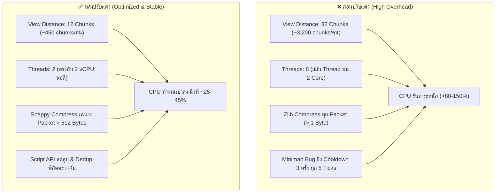

# คู่มือการปรับแต่งเซิร์ฟเวอร์ Minecraft Bedrock ให้ลื่นไหล (Server Performance Guide)

เอกสารสรุปแนวทางการปรับแต่งประสิทธิภาพ (Performance Optimization) สำหรับเซิร์ฟเวอร์ Minecraft Bedrock Dedicated Server (BDS) พร้อมวิเคราะห์เปรียบเทียบสเปก ก่อน-หลัง และการแก้ไขโค้ด Script API อย่างละเอียด

---

## 1. ข้อมูลสเปกเครื่องและการวิเคราะห์คอขวด (Baseline & Bottlenecks)

### 📊 ข้อมูลฮาร์ดแวร์เซิร์ฟเวอร์
- **CPU**: 2 vCPU (พิกัดสูงสุด 200%) — *สถานะปกติใช้งาน ~43.60%*
- **Memory (RAM)**: 4.00 GiB — *ใช้งาน ~719.69 MiB (เหลือว่าง ~3.28 GiB หรือ ~82%)*
- **Disk Storage**: 10.00 GiB — *ใช้งาน ~1.39 GiB (เหลือว่าง ~8.61 GiB)*

### 🔍 การวิเคราะห์ทางเทคนิค (Root Cause Analysis)
1. **RAM และ Disk เหลือเฟือมาก**: การใช้งาน RAM ไม่ถึง 1 GB และ Disk ว่างเกิน 80% ปัญหาเซิร์ฟเวอร์กระตุกจึงไม่ได้เกิดจาก Memory Leak หรือพื้นที่เต็ม
2. **CPU คือคอขวดหลัก (Bottleneck)**:
   - เซิร์ฟเวอร์มีเพียง 2 คอร์เสมือน (2 vCPU) แต่การตั้งค่าเดิมกำหนด `max-threads=8` ทำให้ระบบปฏิบัติการเกิด **CPU Thread Context Switching Overhead** สลับคิวงานไปมาจนสูญเสียรอบประมวลผลฟรี
   - `view-distance=32` บังคับให้เซิร์ฟเวอร์ต้องโหลดและแคชบล็อกมหาศาลต่อผู้เล่น 1 คน เมื่อผู้เล่นบินหรือสำรวจแมพ CPU จะพุ่งชน 200% ทันที
   - การบีบอัดข้อมูลแบบ `zlib` ที่ `threshold=1` บังคับให้ CPU คำนวณบีบอัดทุกแพ็กเก็ตแม้จะมีขนาดแค่ไม่กี่ไบต์
3. **Script API Loop ทำงานเกินความจำเป็น**: มีโค้ด Script ทำงานซ้ำซ้อนและมีบั๊ก Logic เช็กความถี่ที่ส่งผลให้คำสั่งยิงแพ็กเก็ตทุกติ๊ก

---

## 2. ตารางเปรียบเทียบ ก่อน - หลัง ปรับแต่ง (Before vs After)



### 📋 ตารางสรุปพารามิเตอร์ทั้งหมด

| รายการ / ไฟล์ | ก่อนแก้ไข (Before) | หลังแก้ไข (After) | ผลลัพธ์เชิงประสิทธิภาพ |
| :--- | :--- | :--- | :--- |
| **`view-distance`**<br>`server.properties` | `32` Chunks | **`12` Chunks** | ลดจำนวน Chunk โหลดรอบตัวผู้เล่นจาก **~3,200** เหลือเพียง **~450 Chunks** (ลดภาระลง **85.9%**) |
| **`max-threads`**<br>`server.properties` | `8` Threads | **`2` Threads** | ฟิกซ์เท่ากับ 2 vCPU ขจัดปัญหา Context Switching ลาเทนซีเซิร์ฟเวอร์เสถียรขึ้น |
| **`compression-algorithm`**<br>`server.properties` | `zlib` | **`snappy`** | อัลกอริทึม Snappy ใช้ CPU น้อยกว่า zlib หลายเท่า เหมาะกับเครื่อง 2 คอร์ |
| **`compression-threshold`**<br>`server.properties` | `1` Byte | **`512` Bytes** | ยกเลิกการบีบแพ็กเก็ตเล็กๆ คืนรอบ CPU ให้ Tick Loop หลัก |
| **`content-log-level`**<br>`server.properties` | `info` | **`error`** | ลด Disk I/O เขียนไฟล์ log ถี่เกินจำเป็น |
| **`content-log-console...`**<br>`server.properties` | `true` | **`false`** | ปิดการพ่นข้อความลงคอนโซล ลด Terminal I/O Blocking |
| **Minimap HUD Sync**<br>`Minimap.js` | `elapsed % 300 !== 0`<br>*(รัน 299 ใน 300 รอบ!)* | **`elapsed % 300 === 0`**<br>*(รันทุก 15 วินาทีจริง)* | **แก้บั๊กวิกฤต!** หยุดยิงคำสั่ง `startItemCooldown` 3 รอบต่อ 5 ticks |
| **Waypoint Hologram**<br>`WaypointHologram.js` | รันทุก `5` Ticks | **รันทุก `10` Ticks** | ลดการ Teleport Entity และคำนวณระยะห่างลง **50%** |
| **Crop Trample Protect**<br>`cropProtection.js` | สแกนซ้ำ 5 พิกัด + สแกนตลอดแม้มีบัฟ | **Dedup ด้วย `Set` + ข้ามทันทีถ้ามีบัฟ** | ตัด C++ JNI Block Calls ออกได้ **100%** เมื่อผู้เล่นลอยตัวลง |

---

## 3. รายละเอียดการแก้ไขใน server.properties

ไฟล์: [server.properties](file:///c:/Users/ZirconX/Desktop/Server%20Testing/server.properties)

### 3.1 การปรับลดระยะการมองเห็น (`view-distance`)
```properties
# เดิม: view-distance=32
view-distance=12
```
- **สูตรคำนวณ**: พื้นที่ Chunk รอบตัวผู้เล่นคิดจาก $(2r+1)^2$
  - รัศมี 32 = $(64+1)^2 = 4,225$ Chunks ทางทฤษฎี (เซิร์ฟเวอร์จำกัดแถบที่ประมาณ 3,200)
  - รัศมี 12 = $(24+1)^2 = 625$ Chunks (โหลดจริงประมาณ 450 Chunks)
- **ผลลัพธ์**: ประหยัดทั้ง RAM ในการเก็บแคชบล็อก และ CPU ในการคำนวณ Entity/Light update เมื่อผู้เล่นเคลื่อนที่

### 3.2 การจำกัด Thread ให้ตรงกับ vCPU (`max-threads`)
```properties
# เดิม: max-threads=8
max-threads=2
```
- บน Linux/Windows Hypervisor หากเครื่องมี 2 vCPU แต่โปรแกรมแตก 8 Threads ตัว Scheduler จะต้อง Pause เธรดหนึ่งเพื่อรันอีกเธรดหนึ่งสลับไปมาตลอดเวลา การกำหนดเท่ากับจำนวนคอร์จริง (`2`) ช่วยให้การทำงานต่อเนื่อง ไม่มี Overhead

### 3.3 เปลี่ยนระบบบีบอัดแพ็กเก็ตเครือข่าย (`compression-algorithm` & `threshold`)
```properties
# เดิม: compression-algorithm=zlib, compression-threshold=1
compression-threshold=512
compression-algorithm=snappy
```
- `zlib` ใช้กำลัง CPU ในการคำนวณค่อนข้างสูง (เน้นขนาดไฟล์เล็ก)
- `snappy` ของ Google ออกแบบมาเพื่อเน้นความเร็วในการประมวลผล ใช้ CPU ต่ำมาก เหมาะกับเซิร์ฟเวอร์เกม
- ปรับ `threshold=512` เพื่อไม่ให้เสียเวลานำแพ็กเก็ตเล็ก (เช่น ตำแหน่งผู้เล่น, การหันมุมมอง) เข้าอัลกอริทึมบีบอัด

### 3.4 ปิดการพ่น Logging ที่ไม่จำเป็น
```properties
# เดิม: content-log-console-output-enabled=true, content-log-level=info
content-log-console-output-enabled=false
content-log-level=error
```
- ช่วยลดการหน่วงของระบบ Synchronous Console I/O บนเทอร์มินัลเซิร์ฟเวอร์

---

## 4. รายละเอียดการแก้ไขในสคริปต์ Addon (Script API)

### 4.1 แก้บั๊ก HUD Sync Loop ใน [Minimap.js](file:///c:/Users/ZirconX/Desktop/Server%20Testing/development_behavior_packs/Moblie%20-%20BP/scripts/systems/gps/Minimap.js#L644-L647)

**ปัญหาที่พบ**: โค้ดเดิมใช้เครื่องหมาย `!==` แทน `===`
```javascript
// โค้ดเดิม (บั๊ก): รันทุกรอบ ยกเว้นรอบที่หาร 300 ลงตัว
if (elapsedTicks % Minimap.HUD_SYNC_INTERVAL !== 0) this.#syncHud();

// โค้ดที่ถูกต้อง: รันเฉพาะรอบที่ครบกำหนด 15 วินาที
if (elapsedTicks % Minimap.HUD_SYNC_INTERVAL === 0) this.#syncHud();
```
- ฟังก์ชัน `#syncHud()` สั่งให้ `player.startItemCooldown()` ถึง 3 ชนิด เพื่อส่งข้อมูล Setting ไปยัง Client HUD
- เมื่อรันทุก 5 ticks (4 ครั้งต่อวินาที) ต่อผู้เล่นทุกคน ทำให้เซิร์ฟเวอร์ส่ง Packet รัวโดยไม่จำเป็น

---

### 4.2 ปรับรอบความถี่ของ [WaypointHologram.js](file:///c:/Users/ZirconX/Desktop/Server%20Testing/development_behavior_packs/Moblie%20-%20BP/scripts/systems/gps/WaypointHologram.js#L225-L227)

```javascript
// เดิม: ทุก 5 ticks (0.25 วินาที)
this.updateIntervalId = system.runInterval(this.update, 10);
```
- โฮโลแกรมบอกระยะหมุด เช่น `[120m]` เป็นข้อมูลที่ผู้เล่นไม่ได้ต้องการอัปเดตแบบเรียลไทม์ระดับเสี้ยววินาที
- การเปลี่ยนเป็น 10 ticks (0.5 วินาที) ช่วยลดการเรียกคำสั่ง `hologram.teleport(orbitLoc)` และ `hologram.nameTag = ...` ลงครึ่งหนึ่งทันที

---

### 4.3 ปรับปรุงอัลกอริทึมกันเหยียบแปลงผัก [cropProtection.js](file:///c:/Users/ZirconX/Desktop/Server%20Testing/development_behavior_packs/Moblie%20-%20BP/scripts/world/cropProtection.js#L60-L101)

1. **ข้ามการสแกนหากมีบัฟป้องกันอยู่แล้ว**:
```javascript
// ถ้าผู้เล่นเพิ่งได้รับ slow_falling จากติ๊กก่อนหน้า ไม่จำเป็นต้องสแกนบล็อกซ้ำ
if (player.getEffect("slow_falling")) {
    continue;
}
```
2. **Deduplicate พิกัด X/Z ก่อนสแกน**:
- ผู้เล่นมีขนาด 0.6 บล็อก โค้ดเดิมใช้ 5 จุดรอบเท้า เมื่อ `Math.floor()` แล้ว จุดส่วนใหญ่จะตกอยู่ที่บล็อกเดียวกัน ทำให้เกิดการเรียก `dim.getBlock()` ซ้ำซ้อน
- ปรับใช้ `Set` บันทึกคอลัมน์ `${sampleX},${sampleZ}` เพื่อสแกนแต่ละบล็อกเพียงครั้งเดียว

---

### 4.4 ระบบหมุดนำทาง & โฮโลแกรม 3D ไร้แล็ก (GPS Waypoint & Hologram Ultra Optimization)

ไฟล์: [WaypointHologram.js](file:///c:/Users/ZirconX/Desktop/Server%20Testing/development_behavior_packs/Moblie%20-%20BP/scripts/systems/gps/WaypointHologram.js), [GpsOffhandManager.js](file:///c:/Users/ZirconX/Desktop/Server%20Testing/development_behavior_packs/Moblie%20-%20BP/scripts/systems/gps/GpsOffhandManager.js), [Waypoints.js](file:///c:/Users/ZirconX/Desktop/Server%20Testing/development_behavior_packs/Moblie%20-%20BP/scripts/systems/gps/Waypoints.js)

1. **จำกัดหมุดสูงสุด 3 จุด (`MAX_DIM_WAYPOINTS = 3`)**:
   - ตัดภาระการส่ง Packet Cooldown บน Minimap จาก 30 หมุด (90 คำสั่ง) เหลือเพียง 3 หมุด (9 คำสั่ง) ลดภาระลง **90%**
2. **Smart Lifecycle Culling (เกิดเฉพาะตอนเปิด GPS / หายไปเองเมื่อปิด)**:
   - ป้าย 3D Hologram จะ Spawn เอนทิตีในโลก **เฉพาะตอนที่ผู้เล่นเปิด GPS บนหน้าจอ (มีแผนที่ในมือซ้าย) เท่านั้น**
   - เมื่อผู้เล่น **ปิด GPS** หรือเก็บมือซ้าย ระบบจะ **Despawn เอนทิตีโฮโลแกรมทิ้งทันที (0 Entity ในโลก)** คืนทรัพยากร CPU และ RAM เซิร์ฟเวอร์ 100%
   - ข้อมูลพิกัดทั้ง 3 จุดยังคงถูกจัดเก็บปลอดภัย 100% ใน `DynamicProperty` ของผู้เล่น เมื่อเปิด GPS ใหม่ ป้ายจะปรากฏกลับมาเอง
3. **Arrival Auto-Cull (ถึงที่หมายแล้วซ่อนทันที ไม่กิน Tick Loop ต่อ)**:
   - เมื่อผู้เล่นเดินเข้าใกล้พิกัดหมุดในระยะ $\le 5$ บล็อก ระบบจะแจ้งเตือน `§a✔ ถึงที่หมาย "..." เรียบร้อยแล้ว!`
   - ลบเอนทิตีออกจากโลกและถอดหมุดออกจากรายการ `holograms` Loop ทันที ทำให้ **ไม่ต้องวน Loop ตรวจสอบอีกต่อไป (Zero CPU overhead)**
4. **Network & Packet Throttling**:
   - ไม่สั่ง `teleport()` หากผู้เล่นยืนนิ่งหรือเคลื่อนที่เปลี่ยนไปไม่เกิน `0.25` บล็อก
   - ไม่อัปเดต `nameTag` หรือ Property `Distance` หากระยะห่างเปลี่ยนไปไม่ถึง `1` เมตร
5. **Admin Purge & Reset Tools**:
   - เพิ่มปุ่มในเมนูแอดมิน (`openGpsAdminManager`):
     - **ล้างโฮโลแกรมค้างทั่วเซิร์ฟ**: กวาดลบเอนทิตี `mbp_mma:waypoint_hologram` ที่อาจตกค้างในทุกมิติทันที
     - **รีเซ็ตหมุดพิกัดของผู้เล่นทุกคน**: ล้างข้อมูลพิกัดของผู้เล่นทุกคนให้กลับเป็น 0/3 จุด

---

## 5. คำสั่งและคำแนะนำเสริมในการดูแลเซิร์ฟเวอร์ (Maintenance)

### 📌 คำสั่งแนะนำให้รันในเกม (In-game Gamerules)
```mcfunction
# ลดความถี่การสุ่มอัปเดตบล็อก (ค่ามาตรฐานคือ 1)
/gamerule randomTickSpeed 1

# ป้องกันคำสั่งลูปค้าง
/gamerule maxCommandChainLength 65536
```

### 🔄 ขั้นตอนหลังจากแก้ไข
1. **Restart เซิร์ฟเวอร์**: เพื่อให้ค่าใน `server.properties` มีผลอย่างสมบูรณ์
2. **มอนิเตอร์ TPS**: ตรวจสอบว่า TPS อยู่ที่ระดับ 20.0 นิ่ง และ CPU คงที่
