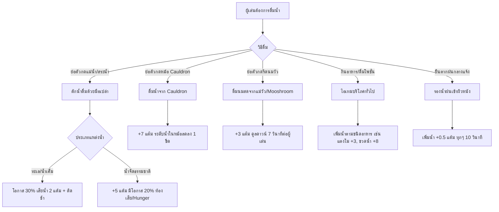

# ระบบกระหายน้ำฉบับสมบูรณ์ (Realistic Thirst & Hydration System)

> เอกสารสรุปโครงสร้าง สถาปัตยกรรม เทคนิคการเรนเดอร์ JSON UI HUD การดื่มน้ำ ระบบ Dehydration และจุดเชื่อมต่อไฟล์ทั้งหมดของแอดออน Minecraft Bedrock 1.21+

---

## 1. บทนำและภาพรวมของระบบ (Overview)

ระบบ **Thirst & Hydration System** เป็นระบบจำลองความกระหายน้ำแบบเรียลไทม์ที่ทำงานควบคู่กับหลอดอาหาร (Hunger Bar) ของตัวเกมหลัก โดยแสดงผลผ่านแถบไอคอนหยดน้ำ 10 ช่อง (20 ระดับ + 1 บัฟเฟอร์ = สูงสุด 21 แต้ม) เหนือหลอดอาหาร

ระบบถูกออกแบบให้สมจริงตามหลักสรีรวิทยาและสภาพแวดล้อม พร้อมระบบสั่นเตือนอันตรายแบบเดียวกับหลอดอาหารของตัวเกม Minecraft ดั้งเดิม และผสานการทำงานกับแอปพลิเคชันสมาร์ตโฟน (เช่น การซ่อน HUD อัตโนมัติเมื่อใช้แอปกล้อง)

---

## 2. จุดเชื่อมต่อและการลงทะเบียนระบบ (Entry Points & Registrations)

ระบบจะเริ่มทำงานทันทีเมื่อติดตั้งแอดออน โดยเชื่อมต่อผ่านไฟล์ต่างๆ ดังนี้:

### 1. ฝั่ง Behavior Pack (BP):
- **จุดโหลดหลัก (`scripts/main.js`)**:
  ```javascript
  import "./systems/thirst/ThirstDrain.js";
  import "./systems/thirst/ThirstConsumption.js";
  import "./systems/thirst/ThirstCommands.js";
  ```
- **การเชื่อมต่อกับแอปกล้อง (`scripts/smartphone/apps/camera.js`)**:
  ```javascript
  import { thirstManager } from "../../systems/thirst/ThirstManager.js";
  // ตอนเปิดกล้อง:
  thirstManager.hideHUD(player);
  player.addTag("camera_active");
  // ตอนปิดกล้อง / ขยับตัว / reload:
  player.removeTag("camera_active");
  thirstManager.syncHUD(player);
  ```

### 2. ฝั่ง Resource Pack (RP):
- **ลงทะเบียน UI (`ui/_ui_defs.json`)**:
  ```json
  "ui_defs": [
    ...
    "ui/thirst_bar/hud.json"
  ]
  ```
- **ลงทะเบียน Texture (`textures/textures_list.json`)**:
  ```json
  "textures/ui/thirsty_bar/thirst_background",
  "textures/ui/thirsty_bar/thirst_full",
  "textures/ui/thirsty_bar/thirst_half",
  "textures/ui/thirsty_bar/thirst_warn",
  "textures/ui/thirsty_bar/thirst_warn_half",
  "textures/ui/thirsty_bar/thirst_danger",
  "textures/ui/thirsty_bar/thirst_danger_half"
  ```
- **การอินเจ็กต์เข้าหน้าจอเกม (`ui/hud_screen.json`)**:
  - `centered_gui_elements_at_bottom_middle`: แทรก `thirsty_bar@hud_thirst.thirsty_bar` หลัง `hunger_rend`
  - `centered_gui_elements_at_bottom_middle_touch`: รองรับการควบคุมแบบสัมผัส (Touch Screen)
  - `root_panel`: ฝัง `thirsty_bar_data_binding@hud_thirst.thirsty_bar_data` ดักจับแพ็กเก็ต Title

---

## 3. โครงสร้างไฟล์และสถาปัตยกรรม (File Architecture)

```
📁 development_behavior_packs/Moblie - BP/scripts/systems/thirst/
├── 📄 ThirstConfig.js       # ค่าคงที่ ค่าน้ำของอาหาร อัตราลดน้ำ และสภาพแวดล้อม
├── 📄 ThirstManager.js      # จัดการ Dynamic Property และแพ็กเก็ต Title สู่ JSON UI
├── 📄 ThirstDrain.js        # ลูปคำนวณอัตราการสูญเสียน้ำ สภาพอากาศ การกระโดด วิ่ง และดีบัฟฟ์
├── 📄 ThirstConsumption.js  # การดื่มน้ำจากแหล่งน้ำ คลูดรอน นมวัว และอาหาร/ยา
└── 📄 ThirstCommands.js     # คำสั่งแอดมินผ่าน /scriptevent thirst:<command>

📁 development_resource_packs/Moblie - RP/
├── 📄 ui/thirst_bar/hud.json # เลย์เอาต์และ Binding แถบหยดน้ำ (Normal + Shaking Animation)
├── 📄 ui/hud_screen.json     # อินเจ็กต์แถบหลอดน้ำเข้าเหนือหลอดอาหาร (hunger_rend)
└── 📁 textures/ui/thirsty_bar/
    ├── 🖼️ thirst_background.png # กรอบหยดน้ำว่างเปล่าสีดำ
    ├── 🖼️ thirst_full.png       # หยดน้ำสีฟ้าเต็มหยด (ระดับปกติ 15-21)
    ├── 🖼️ thirst_half.png       # หยดน้ำสีฟ้าครึ่งหยด
    ├── 🖼️ thirst_warn.png       # หยดน้ำสีส้ม/เหลืองเต็มหยด (ระดับเตือน 7-14)
    ├── 🖼️ thirst_warn_half.png  # หยดน้ำสีส้ม/เหลืองครึ่งหยด
    ├── 🖼️ thirst_danger.png     # หยดน้ำสีแดงเต็มหยด (ระดับวิกฤต 1-6)
    └── 🖼️ thirst_danger_half.png # หยดน้ำสีแดงครึ่งหยด
```

---

## 4. สถานะและการแสดงผลบน HUD (Visual States & HUD Binding)

หลอดน้ำตั้งอยู่ตำแหน่งเหนือหลอดอาหารของผู้เล่น (แทรกต่อจาก `hunger_rend`) มีทั้งหมด 4 ระดับสี พร้อมระบบตรวจจับโหมดกล้อง:

| ระดับค่าน้ำ | สีของหยดน้ำ | พฤติกรรมบนหน้าจอ | ผลกระทบต่อตัวละคร |
| :---: | :---: | :--- | :--- |
| **15 – 21** | สีฟ้าสดใส (Blue) | นิ่งปกติ | ร่างกายสมบูรณ์ ฟื้นฟูเลือดตามธรรมชาติได้ปกติ |
| **7 – 14** | สีส้ม/เหลือง (Warn) | นิ่งปกติ | เริ่มกระหายน้ำ ส่งสัญญาณเตือนให้หาแหล่งน้ำ |
| **1 – 6** | สีแดงเตือนภัย (Danger) | **สั่นไหวขึ้น-ลง (Shaking Animation)** | ติดสถานะ Slowness วิ่งแล้วมีเหงื่อหยด |
| **0** | พื้นหลังดำ 10 ช่อง (Empty) | **สั่นไหวขึ้น-ลงต่อเนื่อง** | ติด Weakness, Nausea, หอบเหนื่อย เสียเลือด 3 หน่วยทุก 4 วินาที |
| **-1** | ซ่อนทั้งหมด (Hidden) | **ไม่แสดงผลใดๆ (0 ไอคอน)** | เข้าโหมดกล้องสมาร์ตโฟน (F1 Camera Zoom) |

### สถาปัตยกรรม JSON UI Data-Binding:
1. **Title Protocol Synchronization**:
   - สคริปต์ส่ง Title รหัสล่องหน: `player.onScreenDisplay.setTitle("§d§m§z§t§b§r§r§f" + intVal)`
   - JSON UI ดักจับสตริงผ่าน `thirsty_bar_data` โดยตัดคำนำหน้าออกแล้วแปลงเป็นตัวเลข `#thirst_value`
2. **การคำนวณตำแหน่งหยดน้ำ (Collection Index Math)**:
   - แถบหลอดน้ำประกอบด้วยช่อง Factory 10 ช่อง (Index `0` ถึง `9`)
   - สมการคำนวณขีดพลังงานต่อช่อง: `(((#collection_index - 10) * -2) - 1)`
     - ช่องขวาสุด (Index 9): แทนระดับน้ำที่ 1 (ครึ่งหยด) และ 2 (เต็มหยด)
     - ช่องถัดมา (Index 8): แทนระดับน้ำที่ 3 และ 4
     - ช่องซ้ายสุด (Index 0): แทนระดับน้ำที่ 19 และ 20
3. **การแยกพาเนล Normal และ Shaking**:
   - `normal_panel`: ทำงานเมื่อ `(#thirst_value > 6)` แสดงสีฟ้าและสีส้ม
   - `shaking_panel`: ทำงานเมื่อ `((#thirst_value > -1) and (not (#thirst_value > 6)))` ควบคุมการสั่นผ่าน `@hud_thirst.thirst_shake_1`
   - **กฎเหล็กของ JSON UI**: ห้ามใช้ตัวดำเนินการ `>=` หรือ `<=` เนื่องจากเอนจิน Bedrock ไม่รองรับ จะทำให้เกิด Parse Error และหลอดน้ำหายไปทั้งหลอด

---

## 5. ปัจจัยการสูญเสียน้ำ (Dehydration Dynamics)

อัตราการลดของน้ำคำนวณทุกๆ 10 ทิกส์ (0.5 วินาที) โดยมีตัวคูณจากสภาพแวดล้อมและการกระทำดังนี้:

### 1. ความยากของเกม (Difficulty Base Drain):
- **Peaceful**: ไม่ลด (0)
- **Easy**: 0.00526 แต้ม/วินาที
- **Normal**: 0.00625 แต้ม/วินาที
- **Hard**: 0.00714 แต้ม/วินาที

### 2. การเคลื่อนไหวและกายภาพ:
- **วิ่ง (Sprint)**: เพิ่มอัตราการลดน้ำ 1.8x พร้อมปล่อยอนุภาคหยาดเหงื่อ (`falling_dripstone_water_particle`) เมื่อน้ำต่ำกว่า 6
- **กระโดด (Jump)**: ตัวคูณเพิ่ม 1.2x
- **ฟื้นฟูเลือดเร็ว (Fast Health Regen)**: หากเลือดลดแล้วหลอดอาหารเต็ม การรีเจนเลือดจะดึงน้ำไปใช้เพิ่มอีก 0.1 แต้ม/ครั้ง

### 3. สภาพแวดล้อมและมิติ (Environmental Multipliers):
- **มิติ Nether**: x1.5 (ความร้อนสูง ระเหยเร็ว)
- **มิติ The End**: x1.2
- **ทะเลทราย (Desert / Sand)**: x1.3
- **แดดเที่ยงวัน (High Noon: เวลา 4,000–8,000 กลางแจ้ง)**: x1.25
- **ฝนตก (Rain / Thunder)**: x0.8
- **อยู่ในน้ำ / หิมะ**: x0.7

---

## 6. แหล่งเติมน้ำและการดื่ม (Hydration Sources)

ผู้เล่นสามารถเติมน้ำเข้าสู่ร่างกายได้หลายวิธี:



### ตารางค่าน้ำของไอเทมและอาหาร (Food Thirst Values):
- **Potion / Honey Bottle**: +8 แต้ม
- **Milk Bucket**: +10 แต้ม (ล้างสถานะ)
- **Apple / Carrot**: +1.5 แต้ม
- **Melon Slice**: +3 แต้ม
- **Sweet Berries / Glow Berries**: +1 แต้ม
- **Mushroom Stew / Beetroot Soup / Rabbit Stew**: +6 แต้ม
- **Spider Eye / Rotten Flesh**: -2 ถึง -3 แต้ม (กระหายน้ำเพิ่ม)

---

## 7. ระบบแจ้งเตือนบนมือถือ (Smartphone Notifications)

ระบบเชื่อมต่อกับระบบการแจ้งเตือน Notification Toast ของโปรเจกต์:
- **เตือนระดับเริ่มกระหายน้ำ (ต่ำกว่า 10 แต้ม)**: ส่งข้อความแจ้งเตือนสีส้มผ่าน Toast
- **เตือนระดับวิกฤต (ต่ำกว่า 4 แต้ม)**: ส่งข้อความแจ้งเตือนสีแดงเตือนภัยว่ากำลังจะหมดสติ/เสียชีวิตจากการขาดน้ำ
- ระบบจะรีเซ็ตแฟล็กแจ้งเตือนอัตโนมัติเมื่อผู้เล่นดื่มน้ำจนค่าเกินระดับ Threshold

---

## 8. กฎการเกิดใหม่ของผู้เล่น (Respawn Policy)

ตามข้อกำหนดของผู้ใช้งาน (**User Rule: "ให้ไม่เต็ม ค่าคงเดิมเลย แต่ให้พอดีไม่น้อยเกินไป"**):
- เมื่อผู้เล่นตายแล้วเกิดใหม่ ระบบจะไม่รีเซ็ตน้ำให้เต็ม 21
- ค่าน้ำจะคงเดิมตามก่อนตาย แต่หากน้ำต่ำกว่า **12 แต้ม** ระบบจะปรับให้อยู่ที่ **12 แต้ม (Baseline Safe Level)** ทันที เพื่อป้องกันไม่ให้ผู้เล่นเกิดมาแล้วติดลูปตายซ้ำจากการขาดน้ำ

---

## 9. คำสั่งผู้ดูแลระบบ (Admin Commands)

ใช้สั่งการผ่านช่องแชตด้วยระบบ Script Event:

- **ตั้งค่าน้ำเจาะจง**:
  ```mcfunction
  /scriptevent thirst:set <0-21>
  ```
- **ดูค่าน้ำปัจจุบันของผู้เล่น**:
  ```mcfunction
  /scriptevent thirst:get
  ```
- **เติมน้ำให้เต็มหลอดทันที (21/21)**:
  ```mcfunction
  /scriptevent thirst:fill
  ```
*(ทุกคำสั่งจะทำการปลดแท็กค้างของระบบกล้องและบังคับซิงก์หน้าจอ HUD ให้อัตโนมัติ)*
